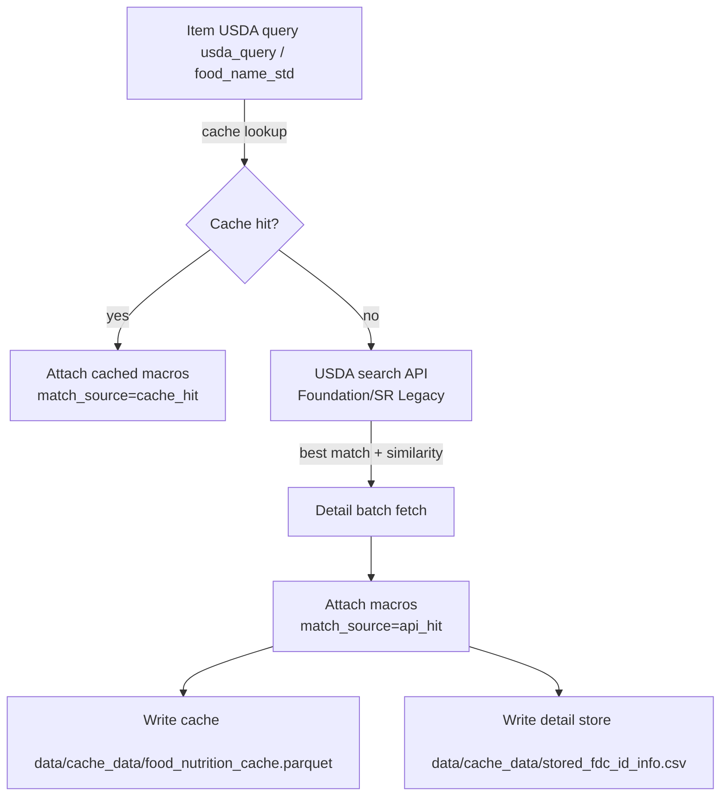

# CBG_analysis

Basic exploratory analysis for meal and blood glucose logs.

Business context: normalize free-text meal logs, attach nutrients, and relate
meals to post-meal glucose so we can spot patterns, defaults, and data quality
issues quickly.

## Quick start (humans)

1) Install deps in your environment: `pip install -r requirements.txt`.
2) Add your USDA key to `config/api_keys.json` under `USDA_food_data`.
3) Run end-to-end: open `notebook/99_run_all_pipeline.ipynb` and run all, or run `python -m src.run_pipeline` from repo root.
4) Check QA outputs in `data/outputs/`: `assumptions_report.csv` (where we filled missing qty/unit/grams) and `manual_review_foods.csv` (items without confident USDA matches).
5) Run `notebook/05_validation_tests.ipynb` to confirm parsing/defaults/USDA coverage and lags look healthy.

## Pipeline overview

The repo now includes a deterministic ETL that ingests the meal Excel, parses foods with quantity/unit handling, applies explicit defaults, enriches via USDA FoodData Central, aggregates to meal-level features, and produces ML-ready tables with same-day lag glucose.

### Run the pipeline

1. Ensure `config/api_keys.json` contains a valid `USDA_food_data` key.
2. Review/edit defaults in `config/defaults_food_items.yaml` (e.g., flaxseed 3 tsp, missing qty/unit -> 100g fallback).
3. From the repo root, run the driver notebook (preferred): open `notebook/99_run_all_pipeline.ipynb` and run all cells; or run via Python:
	```bash
	python -m src.run_pipeline
	```
	(Adjust paths inside the notebook or call `run_pipeline.run_pipeline()` directly.)

Outputs are written to `data/outputs/`:
- `clean_events.csv`: normalized meal/CBG events with parsed datetime, meal labels, and cbg_post values.
- `food_items.csv`: item-level rows (one food per line) with parsed quantities/units, `grams_final`, and USDA nutrient matches.
- `food_nutrition_cache.csv`: CSV export of the USDA cache used in a run; canonical parquet cache lives in `data/parquet/food_nutrition_cache.parquet`.
- `meal_features.csv`: meal-level aggregates (sum of macros, item counts, time features like hour_sin/cos, time_since_prev_meal_same_day).
- `model_table.csv`: ML-ready table with meal features plus same-day lag glucose (`cbg_prev_same_day`).
- `assumptions_report.csv`: rows where defaults/assumptions applied (qty/unit/grams) for audit.
- `manual_review_foods.csv`: items missing USDA matches or relying on assumptions for manual QA.
- `validation_report.json`: summary of validation checks (items/meals/model) for quick health signals.

Glossary for the two QA files:
- assumptions_report.csv: meals/items where we filled missing quantities, units, or grams using defaults or 100g fallback. Start here when tightening defaults.
- manual_review_foods.csv: items without confident USDA matches or heavy assumptions. Use this to add better defaults or seed the USDA cache so reruns improve.

## Current Workflow

1. Run the driver: execute `notebook/99_run_all_pipeline.ipynb` (or `python -m src.run_pipeline`) to regenerate everything under `data/outputs/` and update the USDA cache export.
2. Review QA: inspect `assumptions_report.csv` and `manual_review_foods.csv` to spot missing quantities/units or USDA gaps.
3. Tighten defaults/cache: refine `config/defaults_food_items.yaml` or pre-populate the USDA cache (`data/parquet/food_nutrition_cache.parquet`) for recurring items, then rerun step 1.
4. Validate: open `notebook/05_validation_tests.ipynb` to rerun guardrail checks against the refreshed outputs.
5. Explore: use notebooks `01`–`04` for targeted debugging (ingestion, parsing, USDA coverage, aggregation) without touching the main outputs.

Validation and QA:
- `notebook/05_validation_tests.ipynb` runs quick assertions on parsing/defaults/outputs.
- `validation_report.json` summarizes pipeline validations; rerun after any schema/default change.

### Workflow (high level)


### USDA enrichment & cache flow



### Notebooks

- `notebook/01_ingest_and_profile.ipynb`: inspect and profile raw Excel and clean events.
- `notebook/02_food_parsing_and_units.ipynb`: debug parsing, defaults, and unit conversions.
- `notebook/03_usda_cache_and_enrichment.ipynb`: view USDA cache hits/misses.
- `notebook/04_meal_aggregation_and_model_table.ipynb`: aggregate and view feature tables.
- `notebook/05_validation_tests.ipynb`: quick assertions for units/defaults and output sanity.
- `notebook/99_run_all_pipeline.ipynb`: single entry point to run the entire pipeline and print summary metrics.
- `notebook/data_transformation.ipynb`: scratchpad for prototyping transforms before wiring into the pipeline.

## Data

Input files live in the data folder.

- data/20251218_Trudy_Meals.xlsx
	- Sheets: Dec25 Jan26, Feb2026
	- Dec25 Jan26: 192 rows x 9 columns
		- Date, Time, Meal, BG 2 HRS POST, Protein, Carb, Veggies, Fat, Other
	- Feb2026: 14 rows x 6 columns
		- DATE, TIME, MEAL, BG 2 HRS POST, ITEMS, NOTES

## Notes

- Several columns are sparse, especially Fat, Other, and NOTES.
- Date/Time fields use mixed formats across sheets and will need normalization.